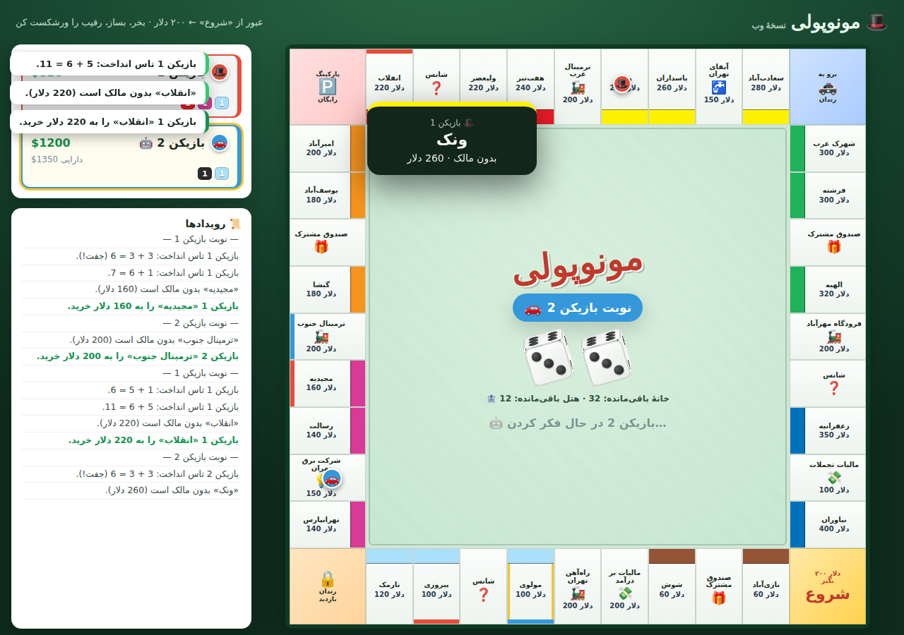

# 🎩 مونوپولی — نسخهٔ وب (فارسی)

یک بازی کامل مونوپولی مبتنی بر مرورگر، ساخته‌شده با **HTML، CSS و JavaScript خالص** —
بدون هیچ مرحلهٔ build و بدون وابستگی. کافی است `index.html` را باز کنی.

رابط کاربری کاملاً **فارسی و راست‌به‌چپ (RTL)** است و خانه‌های تخته با نام
**محله‌های تهران** (نازی‌آباد، مولوی، تهرانپارس، ونک، الهیه، زعفرانیه، نیاوران و …) جایگزین شده‌اند.

امکانات تجربهٔ کاربری: **تاس سه‌بعدی متحرک**، **پاپ‌آپ نام و صاحبِ هر خانه** هنگام فرود
(۳ ثانیه)، **پاپ‌آپ رویدادها در نوبت بازیکن انسانی**، **پاپ‌آپ اعلام برنده** در پایان بازی،
و **نام خانه‌ها به‌صورت صاف و خوانا** (نه وارونه) در هر چهار ضلع تخته.



## ▶ اجرا

```bash
# هر سرور استاتیکی کار می‌کند، مثلاً:
cd monopoly
python3 -m http.server 8000
# سپس http://localhost:8000 را باز کن
```

یا به‌سادگی روی `index.html` دوبار کلیک کن تا در مرورگر باز شود.

## ✨ امکانات — مجموعهٔ کامل قواعد

- **تختهٔ کلاسیک ۴۰ خانه‌ای** با تمام املاک، راه‌آهن‌ها و شرکت‌های خدماتی.
- **۲ تا ۶ بازیکن**، ترکیب دلخواه از **انسان (روی یک صفحه)** و **کامپیوتر (هوش مصنوعی)**.
- **تاس و حرکت** با قانون جفت (دوباره بینداز؛ سه جفت پشت‌سرهم → زندان).
- **خرید یا حراج** هر ملکِ بدون مالک که روی آن فرود می‌آیی.
- **اجاره** برای املاک، راه‌آهن‌ها (بر اساس تعداد) و شرکت‌های خدماتی (تاس ×۴ / ×۱۰).
- **انحصار** اجارهٔ پایه را دو برابر می‌کند و ساخت‌وساز را باز می‌کند.
- **خانه و هتل** با قانون ساخت یکنواخت و محدودیت موجودی بانک (۳۲ خانه، ۱۲ هتل).
- **رهن و آزادسازی** (با ۱۰٪ بهره هنگام آزادسازی).
- **شانس و صندوق مشترک** — هر ۱۶ + ۱۶ کارت، از جمله «آزادی از زندان».
- **زندان** — وثیقهٔ ۵۰ دلار، استفاده از کارت، یا تلاش برای جفت (حداکثر ۳ نوبت).
- **مالیات بر درآمد (۲۰۰ دلار)** و **مالیات تجملات (۱۰۰ دلار)**.
- **عبور از «شروع» ← ۲۰۰ دلار.**
- **معاملهٔ بین بازیکنان** — تبادل ملک و پول، همراه با منطق پذیرش هوش مصنوعی.
- **تسویهٔ بدهی** — با فروش ساختمان‌ها / رهن املاک پول جمع کن، یا **ورشکست** شو.
- **شرط برد** — آخرین سرمایه‌دارِ ورنشکستهٔ باقی‌مانده.

## 🏗 معماری

کد به یک موتور قواعدِ مستقل از رابط و یک رندرکننده تقسیم شده است:

| فایل | مسئولیت |
|------|---------|
| `js/data.js` | دادهٔ ثابت: خانه‌های تخته، قیمت‌ها، اجاره‌ها، ۳۲ کارت، مهره‌ها. |
| `js/game.js` | `MonopolyGame` — موتور قواعد و ماشین حالت (بدون DOM). |
| `js/ui.js`   | `UI` — رندر تخته، مهره‌های متحرک، پنل‌ها، تاس، مودال‌ها. |
| `js/main.js` | `Controller` — صفحهٔ شروع، اتصال‌ها و رانندهٔ بازیکن کامپیوتری. |
| `css/style.css` | تمام استایل — تختهٔ نمدی کلاسیک، خانه‌ها، پنل‌ها و مودال‌ها. |

موتور، حالت و مجموعه‌ای کوچک از متدها را در دسترس می‌گذارد؛ کنترلر رابط/هوش مصنوعی
مقدار `game.pending` را می‌خواند تا بداند کدام تصمیم باز است و با فراخوانی متدها نوبت‌ها
را پیش می‌برد. ارتباط موتور و رابط فقط از طریق چند قلاب
(`render`، `log`، `showCard`، `animateMove`، `gameOver`) انجام می‌شود، بنابراین قواعد
به‌طور کامل و بدون مرورگر قابل تست هستند.

## 🤖 بازیکنان کامپیوتری

حریفان هوش مصنوعی منطقی خرید می‌کنند (با حفظ ذخیرهٔ نقدی، اولویت به ست‌هایی که انحصار
را کامل می‌کنند)، هنگام داشتن پول روی انحصارها یکنواخت می‌سازند، در حراج‌ها تا حدود ۱۲۵٪
قیمت پیشنهاد می‌دهند، زندان را مدیریت می‌کنند، زیر فشار بدهی دارایی نقد می‌کنند و
پیشنهادهای معاملهٔ ورودی را بر اساس ارزش ارزیابی می‌کنند.

---

> نسخهٔ انگلیسی این بازی پیش‌تر در همین مخزن توسعه یافته بود؛ این نسخه ترجمهٔ کامل
> فارسی با چیدمان راست‌به‌چپ است.
